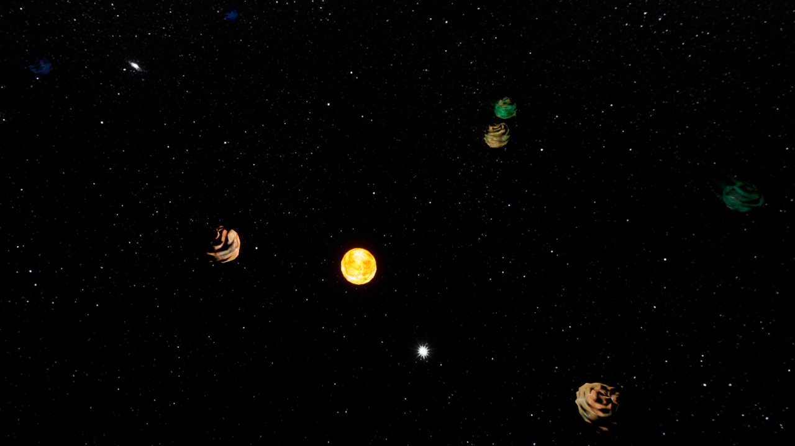
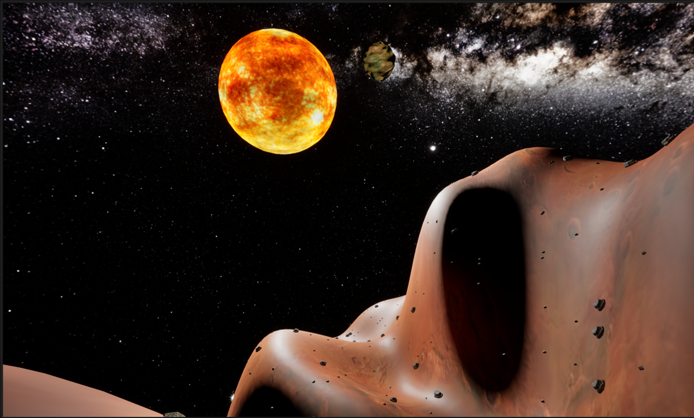
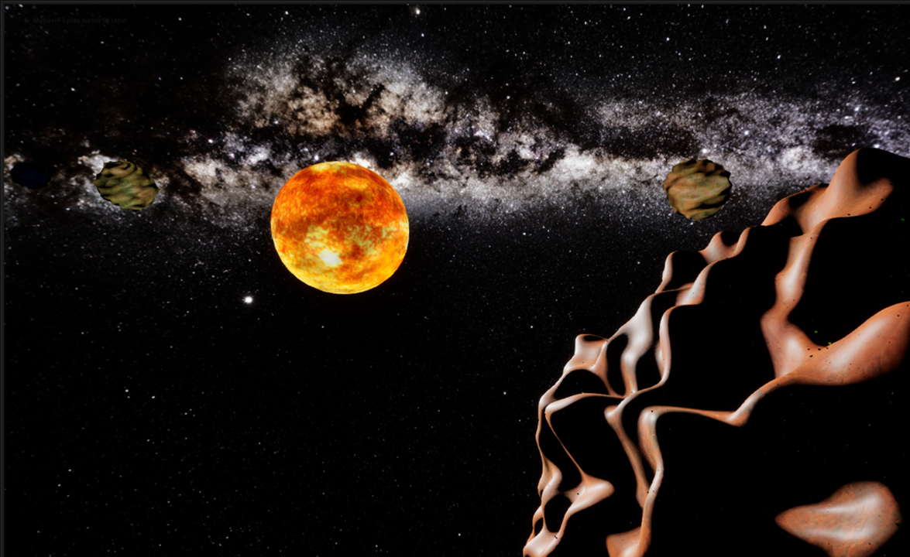
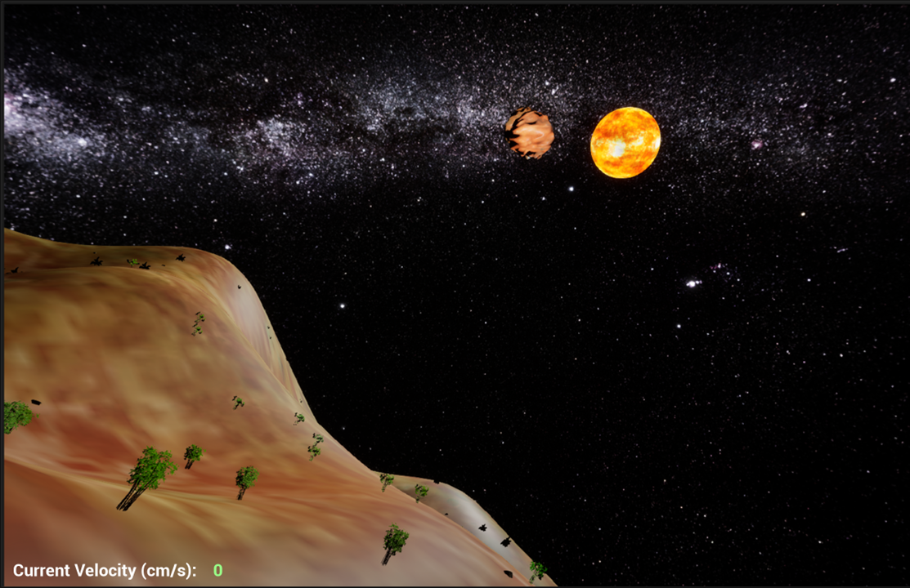
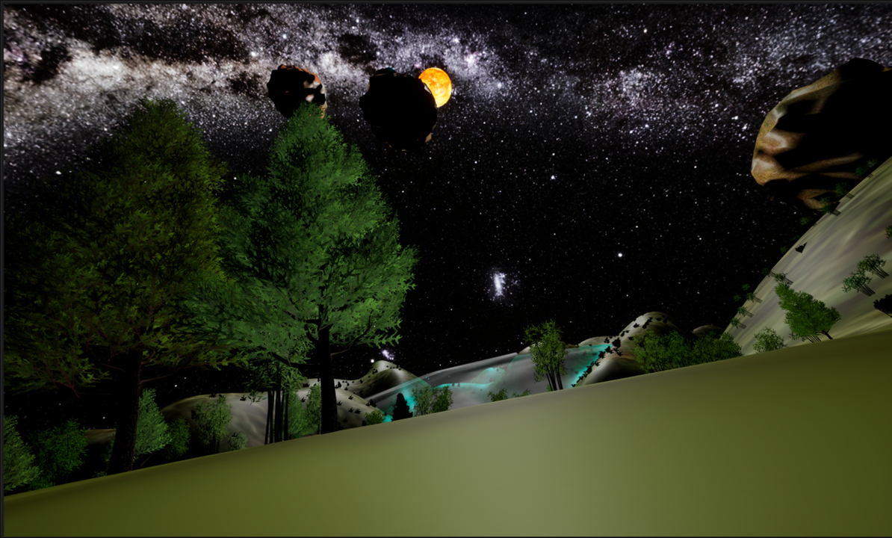
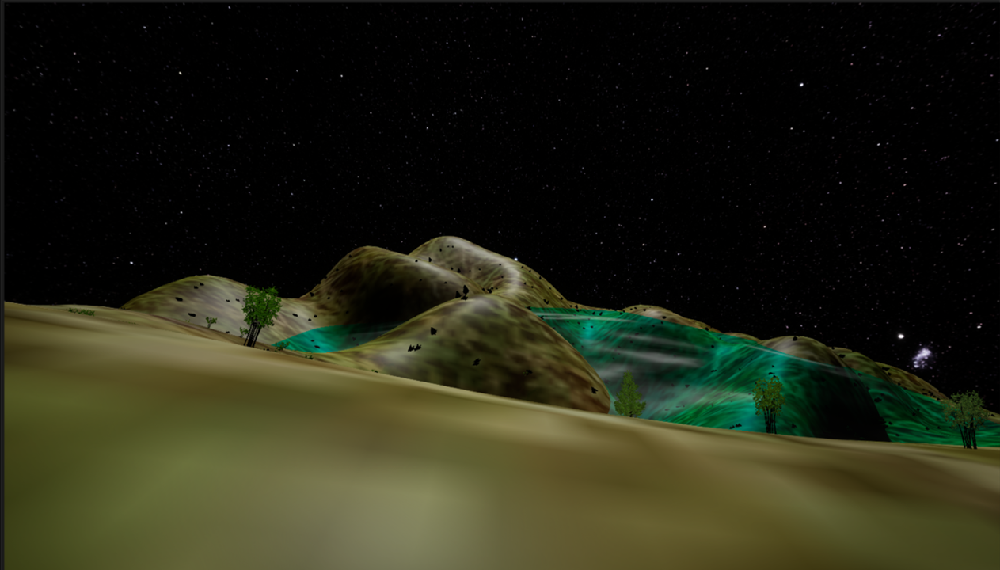

# Procedural Solar System Generator

This project provides an implementation for procedurally generating entire solar systems in **Unreal Engine 5**.  
It is designed to help developers quickly create dynamic and varied space environments for videogames, such as **space exploration games**.  

The system is **fully customizable** from the Unreal Engine editor, allowing you to configure parameters such as:
- Number of planets
- Planet size and appearance
- Star size and luminosity
- Orbital distances
- Planet decorations  

A more detailed explanation about the customizable parameters can be found here: https://johanjoan.gitlab.io/solar_system_generator/

---

## 🧩 Source Code Classes

All the classes of the source code can be found in the [Source/Procedural_Solar_System_Generator](Source/Procedural_Solar_System_Generator/) folder.  
The main classes include:

| Class | Description |
|-------|-------------|
| `MyActorSolarSystemGenerator` | Controls the generation and organization of the entire solar system. |
| `Planet` | Represents a planet. Inherits from `CelestialBody`. |
| `Star` | Represents the solar system's star. Inherits from `CelestialBody`. |
| `CelestialBody` | Parent class of `Planet` and `Star`, which manages common properties of both classes. |
| `LODManager` | Manages the Level Of Detail (LOD) for each celestial body in the solar system. |
| `PerlinNoise` | Generates Perlin noise for creating planet surfaces. Implementation taken from [daniilsjb/perlin-noise](https://github.com/daniilsjb/perlin-noise). |
| `SpeedManager` | Handles changes in the player’s movement speed. |
| `WaterSphere` | Represents a water sphere. Used to add water to planets. |
| `SphereSection` | Represents a section of a sphere, used to build celestial bodies and water spheres. |

---

## 🎮 Demo

A playable demo featuring a solar system with 8 procedurally generated planets is available by downloading [Demo.zip](https://github.com/johanjoan/Procedural_Solar_System_Generator/blob/master/Demo.zip?raw=true) and executing `Procedural_Solar_System_Generator.exe`.

### Controls

| Action | Key | Value / Notes |
|--------|-----|---------------|
| Player Movement | WASD | — |
| Increase Max Velocity, Acceleration, and Deceleration | J | +10% |
| Decrease Max Velocity, Acceleration, and Deceleration | K | -10% |
| Set "Walking" Velocity | C | `MaxVelocity=4800 cm/s, Accel=2048 cm/s, Deaccel=9600 cm/s` |
| Reset to initial values | R | `MaxVelocity=300000 cm/s, Accel=300000 cm/s, Deaccel=600000 cm/s` |

---

## 🖼️ Example Screenshots

  

  

  

  

  

  

---

## 🚀 Future Improvements

Although the present state of the projecte already offers a useful and functional tool, considerable improvements can be made in the future. Below is a list of ideas that I would like to implement in the future:

- 🛰️ **Add satellites to planets**  
  Currently, generated solar systems are relatively simple, as they only contain the star and the planets. Adding the possibility for planets to have satellites orbiting around them would increase system complexity. The implementation should not be excessively complicated, since orbit calculations could be performed similarly to those of the planets.

- 🌍 **Increase planet size**  
  While planets in the current version are already considerably large without compromising performance, it would be interesting to explore making them even bigger. To achieve this, a more efficient LOD management system would need to be implemented in order to minimize the number of mesh vertices rendered, without affecting the user’s visual experience and while ensuring stable performance.

- ⛰️ **Different algorithms for terrain generation**  
  At present, terrain generation for all planets is based on Perlin noise. Although this already produces good results, it could be valuable to give developers the option to choose from other terrain generation techniques.

- 🌊 **Differentiate between aquatic and non-aquatic decorations**  
  Currently, all decorations are handled uniformly, without considering whether they are placed underwater or on land. This can lead to unrealistic cases, such as trees being placed on the seabed. Allowing the user to define each decoration as aquatic or non-aquatic would make the generated planets much more realistic and coherent.

- 🌳 **Less rigid decoration placement**  
  Decoration placement is currently quite rigid, based on a nearly uniform distribution along the planet’s latitudes and longitudes. This results in an artificial and repetitive appearance and does not allow the creation of natural features like forests. Research into alternative placement algorithms would be needed to solve this issue.

- ✨ **Change celestial body mesh modeling**  
  Currently, celestial bodies are represented by a vertex distribution based on latitude and longitude on a sphere. This approach has the disadvantage of excessive vertex concentration at the poles, forcing unnecessary increases in mesh resolution to maintain quality at the equator. A more uniform distribution, such as the Fibonacci sphere, could be used as an alternative.

- 🌱 **Improve decoration evolution methodology**  
  In the current version, decoration evolution is performed simply by randomly repositioning them on the planet’s surface. While this already conveys a sense of dynamism, the changes do not follow any evolutionary logic. An improved strategy could be based on Conway’s Game of Life, where new generations of decorations would be computed after a certain amount of time whenever the player is not close to the planet.

- 🪐 **Improve LOD mechanism**  
  Although the current LOD system for celestial bodies works reasonably well, it still presents some issues. In certain cases, players may experience *popping* (sudden appearance of terrain features such as mountains), and the regions near the poles do not always display the appropriate LOD. To address these problems, a more advanced LOD management approach needs to be explored. One possible solution to mitigate popping artifacts could be the introduction of atmospheric effects or fog, reducing the player's field of view and making transitions smoother and less noticeable.

- 🏙️ **Add non-decorative elements to planets**  
  Beyond purely decorative elements, it would be interesting to add functional components, such as cities. These could either be procedurally generated or manually defined to provide greater control over their structure and functionality.

